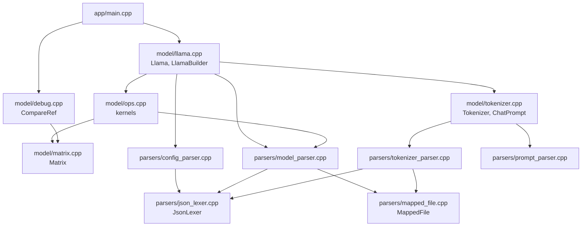
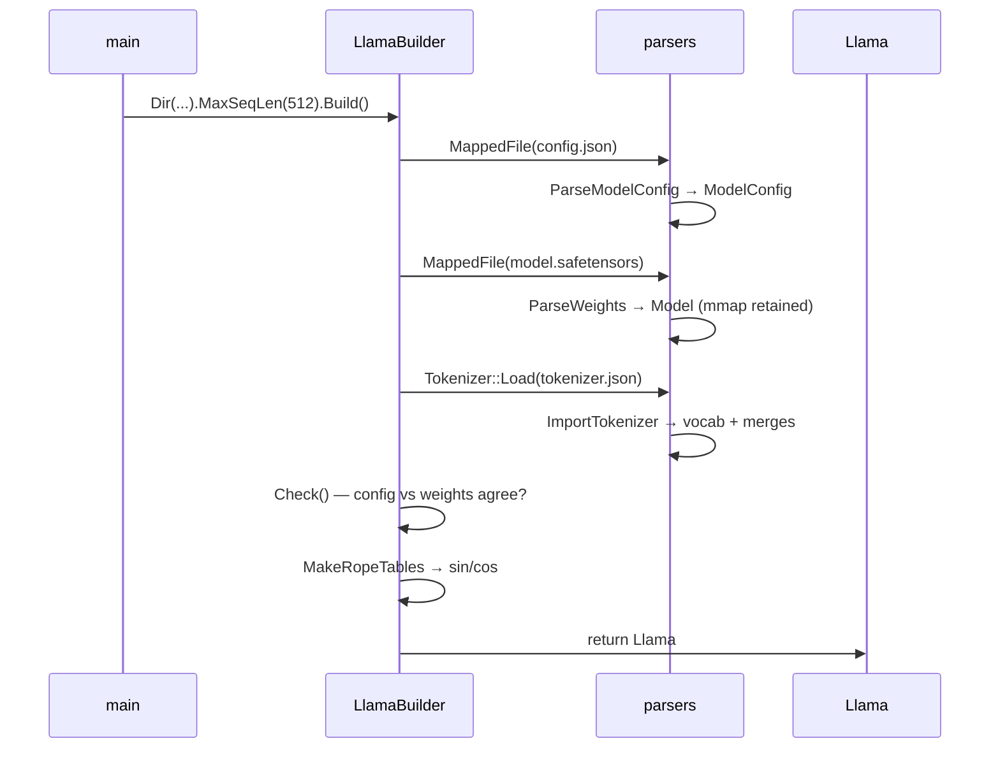

# TinyInference

A Llama 3.2 inference engine written from scratch in C++23. Just libc++, POSIX `mmap`, and
about 1200 lines of code.

It loads stock HuggingFace checkpoints (`config.json`, `model.safetensors`,
`tokenizer.json`) and runs a full forward pass on the CPU.

```
$ ./build/infer
2 + 2 = 4
```
## Quick start

Put a HuggingFace checkpoint in `models/`:

```
models/llama-3.2-1b-instruct/
├── config.json
├── model.safetensors
└── tokenizer.json
```

Build and run:

```bash
cmake -B build -G Ninja && cmake --build build && ./build/infer
```

The prompt, model directory and reference directory are currently hardcoded in
[`src/app/main.cpp`](src/app/main.cpp).

## What it can do

| Capability | Notes |
|---|---|
| Load HF `config.json` | Streaming parse into a validated `ModelConfig`. Handles `rope_scaling`, and `eos_token_id` as either a scalar or a list. |
| Load `model.safetensors` | Parses the JSON header, maps tensors by name, keeps the file `mmap`ed for zero-copy weight access. |
| Load `tokenizer.json` | 17 MB file parsed in a single pass. Vocab, merges and added tokens, with correct byte-level BPE decoding. |
| Tokenize | Byte-level BPE encode: pre-tokenize → per-byte lookup → rank-ordered merges. |
| Llama 3 chat format | `<\|begin_of_text\|>`, `<\|start_header_id\|>role<\|end_header_id\|>`, `<\|eot_id\|>`. |
| Forward pass | RMSNorm, Q/K/V projections, RoPE with llama3 frequency scaling, grouped-query attention with causal mask, softmax, SwiGLU MLP, residuals, tied LM head. |
| Sampling | Greedy (argmax) only. |
| Numerical verification | `CompareRef` diffs any hidden state against a `.bin` reference dump. |

Config is cross-checked against the weights at load time: layer count, vocab
size and hidden size must agree, or the build fails loudly.

## Layout

```
src/
├── app/
│   └── main.cpp              entry point: wires builder → prompt → generate
├── model/
│   ├── llama.cpp             Llama + LlamaBuilder — owns config, weights, tokenizer
│   ├── ops.cpp               all math kernels
│   ├── matrix.cpp            row-major float matrix
│   ├── tokenizer.cpp         Tokenizer (BPE encode/decode) + ChatPrompt
│   └── debug.cpp             CompareRef against reference dumps
├── parsers/
│   ├── mapped_file.cpp       RAII mmap wrapper (move-only)
│   ├── json_lexer.cpp        pull-style JSON lexer, shared by all three parsers
│   ├── config_parser.cpp     config.json          → ModelConfig
│   ├── model_parser.cpp      safetensors header   → Model (tensor views)
│   ├── tokenizer_parser.cpp  tokenizer.json       → vocab + merges
│   └── prompt_parser.cpp     text                 → pre-tokenized words
└── engine/
    └── engine.cpp            unused stub, does not compile
```

The project is a **unity build**: everything is `#include`d into `main.cpp` as
a single translation unit, so `CMakeLists.txt` has exactly one source file.

## Execution flow

### Module graph



`JsonLexer` is the shared foundation: one lexer, three parsers, each walking
its own file its own way. `MappedFile` is the other shared primitive — it owns
the `mmap` and the lifetime of every byte the parsers hand out.

### Startup — `LlamaBuilder::Build()`



Order matters: config comes first because everything downstream is validated
against it. The safetensors `MappedFile` is *moved into* `Model`, so the 2.47 GB
mapping stays alive exactly as long as the tensor pointers that reference it.

### Loading `tokenizer.json`

The 17 MB file is walked once, top to bottom:

1. `added_tokens` — an array of objects. `id` and `content` are read,
   everything else (`lstrip`, `rstrip`, `normalized`, ...) is `SkipValue`d.
   Content is **literal UTF-8** (`<|begin_of_text|>`), so it uses `DecodeUtf8`.
2. `model.vocab` — 128 256 keys. Each key is **byte-level encoded** (`Ġ` means
   byte `0x20`), so it uses `DecodeByteLevel`, which maps each codepoint through
   a 512-entry table back to a raw byte.
3. `model.merges` — ~280 k pairs, 13 MB of the file. Each side is decoded, both
   sides and their concatenation are looked up in the vocab, and the result is
   stored as `(left_id << 32 | right_id) → {rank, new_id}`.

Merges need a complete vocab. Because the file happens to list `vocab` first,
one sequential pass suffices — but if a checkpoint ever puts `merges` first,
the parser parks the offset, skips ahead, and replays it afterwards.

Everything else in the file (`normalizer`, `pre_tokenizer`, `post_processor`,
`decoder`) is skipped.

### Per-token generation — `Llama::Generate()`

```
prompt ids ──> Words2Embeddings ──> [seq_len, 2048] hidden state
                                          │
              ┌───────────────────────────┘
              │
              ▼
      ┌── Forward() ────────────────────────────────────────┐
      │                                                      │
      │  for layer in 0..15:                                 │
      │      x_norm = RMSNorm(x, input_layernorm)             │
      │      Q,K,V  = MatMul(x_norm, {q,k,v}_proj)            │
      │      RoPE(Q, 32 heads) / RoPE(K, 8 heads)             │
      │      attn   = Attention(Q,K,V)   # GQA + causal mask  │
      │      x      = x + MatMul(attn, o_proj)                │
      │                                                      │
      │      h      = RMSNorm(x, post_attn_layernorm)         │
      │      x      = x + MatMul(                             │
      │                   SiLU(h·gate) ⊙ (h·up), down_proj)   │
      │                                                      │
      │  x = RMSNorm(x, final_norm)                           │
      │  logits = LMHead(x.last_row(), embed_tensor)  # tied   │
      │  return ArgMax(logits)                                │
      └──────────────────────────────────────────────────────┘
              │
              ▼
      IsEos(next)? ──yes──> stop
              │no
              ▼
      on_token(next)  ──> main prints tokenizer.Token(next)
      AddEmbedding(embeddings, next)   # append one row
              │
              └──> back to Forward()   # ← recomputes everything
```

That last arrow is the whole performance story: the hidden state grows by one
row per token and the entire stack is recomputed from scratch. A KV cache would
turn the per-token cost from *O(seq²)* into *O(seq)*.

`set_layer_hook` fires once per hidden state (index `0` = embeddings, index
`n_layers` = final norm), which is how `main.cpp` drives the reference
comparison without the model knowing anything about testing.

## Task board

### Parsers

| | Task | Notes |
|---|---|---|
| ✅ | `MappedFile` RAII wrapper | Move-only, closes fd right after `mmap`, checks `MAP_FAILED`. |
| ✅ | `JsonLexer` | Pull-style, `Peek`/`Next`/`NextMember`/`NextElement`, full `SkipValue` with depth tracking. |
| ✅ | `config.json` parser | Required-field bitmask, GQA divisibility check, scalar-or-array `eos_token_id`. |
| ✅ | safetensors header parser | Named lookup, arbitrary shape rank, `__metadata__` skipped, header length bounds-checked. |
| ✅ | `tokenizer.json` parser | Single pass, single `mmap`, fused decode, surrogate pairs, all JSON escapes. |
| ✅ | Byte-level vs literal decode split | `DecodeByteLevel` for vocab/merges, `DecodeUtf8` for added tokens. |
| ❌ | `tokenizer_config.json` parser | `chat_template`, `bos_token`, `eos_token`. Chat format is hardcoded in `ChatPrompt` today. |
| ❌ | Per-tensor bounds check | Header length is validated, but `data_offsets` are not checked against file size. |
| ❌ | `dtype` validation | Field is parsed, never verified. Anything non-BF16 is silently reinterpreted. |
| ❌ | Right-sized `reserve` | Still `content.size() / 8` — 2.1 M buckets for 128 k entries. Should use `vocab_size` from config. |
| 🚧 | Pre-tokenizer | Hand-rolled approximation. The real llama3 regex sits unused in `tokenizer.json`. Deferred: needs Unicode tables. |

### Model

| | Task | Notes |
|---|---|---|
| ✅ | `Matrix` | Row-major, `operator[](row, col)` via C++23 multidimensional subscript. |
| ✅ | RMSNorm, MatMul, Add, Hadamard, SiLU, SoftMax | Verified layer by layer. |
| ✅ | RoPE with llama3 scaling | Low/high frequency wavelength interpolation. |
| ✅ | Grouped-query attention | 32 Q heads over 8 KV heads, causal mask, scaled scores. |
| ✅ | Tied LM head | Reuses `embed_tokens` — no separate output matrix. |
| ✅ | `Llama` + `LlamaBuilder` | Config/weights/tokenizer owned in one place, cross-validated. |
| ✅ | `Tokenizer` + `ChatPrompt` | Encode, id↔token, fluent chat construction. |
| ❌ | **KV cache** | The single biggest win available. Requires reworking `CausalMaskAttn`, which currently assumes `seq_q == seq_k`. |
| ❌ | Sampling | Greedy only — no temperature, top-k, top-p, or repetition penalty. |
| ❌ | Multi-threading | Everything single-threaded. |
| ❌ | SIMD | `MatMul` is scalar with 4-way unrolling. No NEON/AVX. |
| ❌ | Quantization | BF16 only. |
| ❌ | Prefill/decode split | No batched prompt processing. |

### Infrastructure

| | Task | Notes |
|---|---|---|
| ✅ | CMake build | Ninja, C++23, `compile_commands.json` exported. |
| ✅ | Reference comparison harness | `CompareRef` + `.bin` dumps from PyTorch. |
| ❌ | Tests | No unit tests. Verification is the reference dump plus eyeballing output. |
| ❌ | CLI | Prompt, model dir and ref dir are hardcoded in `main.cpp`. |
| ❌ | Real header split | `.cpp` files `#include` each other with `#pragma once`. Works for one target; blocks separate compilation and unit tests. |
| ❌ | Delete or finish `engine/engine.cpp` | Dead stub, missing a semicolon and an include — it would not compile if anything included it. |
| 🚧 | Include hygiene | `model_parser.cpp` includes `tokenizer_parser.cpp` only to reach `JsonLexer` transitively; should include `json_lexer.cpp` directly. |
