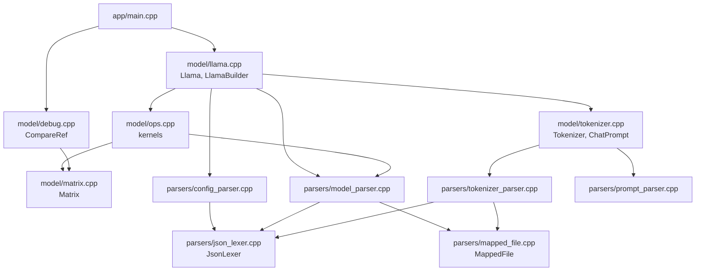
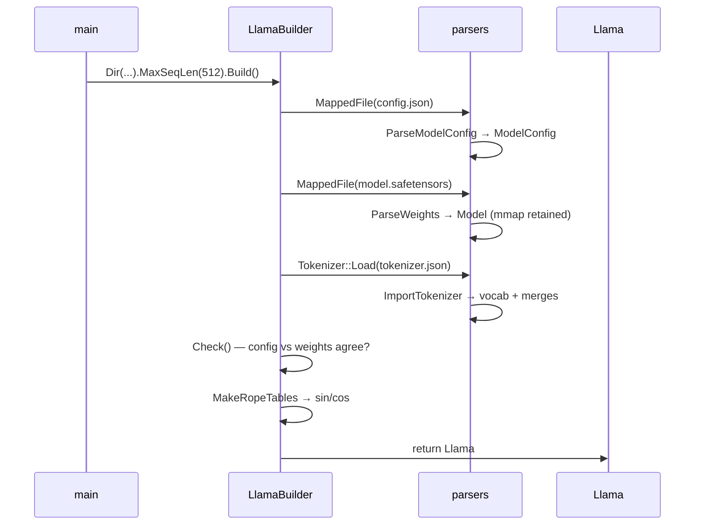

<div align="center">
  <h1>TinyInference</h1>
</div>

<div align="center">
  <b>Llama 3.2 inference written from scratch in C++23</b>
</div>

<div align="center">
  no dependencies · CPU · ~2000 lines · CUDA port in progress
</div>

<br/>

Loads stock HuggingFace checkpoints (`config.json`, `model.safetensors`, `tokenizer.json`)
and runs a full forward pass on the CPU. No BLAS, no JSON library, no tokenizer library —
just libc++ and POSIX `mmap`.

```
$ ./build/infer
2 + 2 = 4
```

## Project Updates

- 🔥 ```2026/08/06```: CUDA kernels migrated from [Madfyre/CUDA](https://github.com/Madfyre/CUDA) into `src/cuda` — staging ground for the GPU port, not wired into the build yet.
- 🔥 ```2026/08/06```: Big refactoring — `Llama` + `LlamaBuilder`, `Tokenizer`, RAII `MappedFile`, a shared `JsonLexer`, and three streaming parsers replacing the hand-rolled string scanning.
- 🔥 ```2026/08/03```: CPU inference works end to end.
- 🔥 ```2026/07/28```: Full attention — GQA, causal mask, softmax, AV — verified layer by layer against a PyTorch reference.
- 🔥 ```2026/07/28```: RMSNorm, MatMul and RoPE on CPU.
- 🔥 ```2026/07/27```: Parsers done.

## Table of Contents

1. [Quick start](#quick-start)
2. [What it can do](#what-it-can-do)
3. [Layout](#layout)
4. [Execution flow](#execution-flow)
5. [CUDA](#cuda)
6. [Todo List](#-todo-list)

## Quick start

Put a HuggingFace checkpoint in `models/`:

```
models/llama-3.2-1b-instruct/
├── config.json
├── model.safetensors
└── tokenizer.json
```

Build and run:

```bash
cmake -B build -G Ninja && cmake --build build && ./build/infer
```

The prompt, model directory and reference directory are currently hardcoded in
[`src/app/main.cpp`](src/app/main.cpp).

### Model Zoo

| Model | Params | Precision | Status |
|---|---|---|---|
| Llama-3.2-1B-Instruct | 1.24 B | BF16 | ✅ verified against PyTorch, all 17 hidden states |
| Llama-3.2-1B | 1.24 B | BF16 | ✅ loads and runs |

## What it can do

| Capability | Notes |
|---|---|
| Load HF `config.json` | Streaming parse into a validated `ModelConfig`. Handles `rope_scaling`, and `eos_token_id` as either a scalar or a list. |
| Load `model.safetensors` | Parses the JSON header, maps tensors by name, keeps the file `mmap`ed for zero-copy weight access. |
| Load `tokenizer.json` | 17 MB file parsed in a single pass. Vocab, merges and added tokens, with correct byte-level BPE decoding. |
| Tokenize | Byte-level BPE encode: pre-tokenize → per-byte lookup → rank-ordered merges. |
| Llama 3 chat format | `<\|begin_of_text\|>`, `<\|start_header_id\|>role<\|end_header_id\|>`, `<\|eot_id\|>`. |
| Forward pass | RMSNorm, Q/K/V projections, RoPE with llama3 frequency scaling, grouped-query attention with causal mask, softmax, SwiGLU MLP, residuals, tied LM head. |
| Sampling | Greedy (argmax) only. |
| Numerical verification | `CompareRef` diffs any hidden state against a `.bin` reference dump. |

Config is cross-checked against the weights at load time: layer count, vocab
size and hidden size must agree, or the build fails loudly.

## Layout

```
src/
├── app/
│   └── main.cpp              entry point: wires builder → prompt → generate
├── model/
│   ├── llama.cpp             Llama + LlamaBuilder — owns config, weights, tokenizer
│   ├── ops.cpp               all math kernels
│   ├── matrix.cpp            row-major float matrix
│   ├── tokenizer.cpp         Tokenizer (BPE encode/decode) + ChatPrompt
│   └── debug.cpp             CompareRef against reference dumps
├── parsers/
│   ├── mapped_file.cpp       RAII mmap wrapper (move-only)
│   ├── json_lexer.cpp        pull-style JSON lexer, shared by all three parsers
│   ├── config_parser.cpp     config.json          → ModelConfig
│   ├── model_parser.cpp      safetensors header   → Model (tensor views)
│   ├── tokenizer_parser.cpp  tokenizer.json       → vocab + merges
│   └── prompt_parser.cpp     text                 → pre-tokenized words
├── cuda/                     GPU port — see src/cuda/README.md
└── engine/
    └── engine.cpp            unused stub, does not compile
```

The CPU engine is a **unity build**: everything is `#include`d into `main.cpp` as
a single translation unit, so `CMakeLists.txt` has exactly one source file.

## Execution flow

### Module graph



`JsonLexer` is the shared foundation: one lexer, three parsers, each walking
its own file its own way. `MappedFile` is the other shared primitive — it owns
the `mmap` and the lifetime of every byte the parsers hand out.

### Startup — `LlamaBuilder::Build()`



Order matters: config comes first because everything downstream is validated
against it. The safetensors `MappedFile` is *moved into* `Model`, so the 2.47 GB
mapping stays alive exactly as long as the tensor pointers that reference it.

### Loading `tokenizer.json`

The 17 MB file is walked once, top to bottom:

1. `added_tokens` — an array of objects. `id` and `content` are read,
   everything else (`lstrip`, `rstrip`, `normalized`, ...) is `SkipValue`d.
   Content is **literal UTF-8** (`<|begin_of_text|>`), so it uses `DecodeUtf8`.
2. `model.vocab` — 128 256 keys. Each key is **byte-level encoded** (`Ġ` means
   byte `0x20`), so it uses `DecodeByteLevel`, which maps each codepoint through
   a 512-entry table back to a raw byte.
3. `model.merges` — ~280 k pairs, 13 MB of the file. Each side is decoded, both
   sides and their concatenation are looked up in the vocab, and the result is
   stored as `(left_id << 32 | right_id) → {rank, new_id}`.

Merges need a complete vocab. Because the file happens to list `vocab` first,
one sequential pass suffices — but if a checkpoint ever puts `merges` first,
the parser parks the offset, skips ahead, and replays it afterwards.

Everything else in the file (`normalizer`, `pre_tokenizer`, `post_processor`,
`decoder`) is skipped.

### Per-token generation — `Llama::Generate()`

```
prompt ids ──> Words2Embeddings ──> [seq_len, 2048] hidden state
                                          │
              ┌───────────────────────────┘
              │
              ▼
      ┌── Forward() ────────────────────────────────────────┐
      │                                                      │
      │  for layer in 0..15:                                 │
      │      x_norm = RMSNorm(x, input_layernorm)             │
      │      Q,K,V  = MatMul(x_norm, {q,k,v}_proj)            │
      │      RoPE(Q, 32 heads) / RoPE(K, 8 heads)             │
      │      attn   = Attention(Q,K,V)   # GQA + causal mask  │
      │      x      = x + MatMul(attn, o_proj)                │
      │                                                      │
      │      h      = RMSNorm(x, post_attn_layernorm)         │
      │      x      = x + MatMul(                             │
      │                   SiLU(h·gate) ⊙ (h·up), down_proj)   │
      │                                                      │
      │  x = RMSNorm(x, final_norm)                           │
      │  logits = LMHead(x.last_row(), embed_tensor)  # tied   │
      │  return ArgMax(logits)                                │
      └──────────────────────────────────────────────────────┘
              │
              ▼
      IsEos(next)? ──yes──> stop
              │no
              ▼
      on_token(next)  ──> main prints tokenizer.Token(next)
      AddEmbedding(embeddings, next)   # append one row
              │
              └──> back to Forward()   # ← recomputes everything
```

That last arrow is the whole performance story: the hidden state grows by one
row per token and the entire stack is recomputed from scratch. A KV cache would
turn the per-token cost from *O(seq²)* into *O(seq)*.

`set_layer_hook` fires once per hidden state (index `0` = embeddings, index
`n_layers` = final norm), which is how `main.cpp` drives the reference
comparison without the model knowing anything about testing.

## CUDA

`src/cuda` holds kernels brought over from [Madfyre/CUDA](https://github.com/Madfyre/CUDA)
as the starting material for a GPU decode path. They are **not part of the CMake
build yet** — each bench driver compiles standalone with `nvcc`.

The shape of the problem, in one paragraph: decode reads every weight in the model
for every single token — 1.95 GB of layer weights plus a 525 MB tied LM head — at
roughly 1 flop per byte. It is bound by memory bandwidth and nothing else, so GEMV
and INT8 quantization matter and tiling does not. Prefill is the mirror image:
same weights read once for all S tokens, FLOPs growing with S, compute-bound,
wants tensor cores. **The two need different kernel families.**

Full analysis, per-kernel plan and build instructions: [`src/cuda/README.md`](src/cuda/README.md)
and [`src/cuda/bench/README.md`](src/cuda/bench/README.md).

## 📑 Todo List

- [ ] Parsers
  - [x] `MappedFile` — RAII `mmap`, move-only, `MAP_FAILED` checked
  - [x] `JsonLexer` — pull-style, full `SkipValue` with depth tracking
  - [x] `config.json` → `ModelConfig`, required-field mask, GQA divisibility check
  - [x] `model.safetensors` header → named tensor views
  - [x] `tokenizer.json` → vocab + merges
      - [x] single pass, single `mmap`
      - [x] byte-level vs literal decode split
      - [x] surrogate pairs and all JSON escapes
      - [ ] size `reserve` from `vocab_size` instead of file size
  - [ ] `tokenizer_config.json` — chat template, bos/eos
  - [ ] `data_offsets` bounds check per tensor
  - [ ] `dtype` validation — parsed today, never verified
  - [ ] pre-tokenizer driven by the llama3 regex instead of the hand-rolled split
- [ ] CPU inference
  - [x] `Matrix` — row-major, C++23 multidimensional subscript
  - [x] RMSNorm, MatMul, Add, Hadamard, SiLU, SoftMax
  - [x] RoPE with llama3 frequency scaling
  - [x] Grouped-query attention — 32 Q heads over 8 KV heads, causal mask
  - [x] Tied LM head
  - [x] `Llama` + `LlamaBuilder`
  - [x] `Tokenizer` + `ChatPrompt`
  - [x] Greedy decoding
  - [ ] **KV cache** — also needs `CausalMaskAttn` reworked, it assumes `seq_q == seq_k`
  - [ ] Sampling — temperature, top-k, top-p, repetition penalty
  - [ ] Multi-threading
  - [ ] SIMD — `MatMul` is scalar with 4-way unrolling
  - [ ] Quantization
- [ ] CUDA
  - [x] Kernels migrated
      - [x] GEMM — tiled, register-blocked, plus a CUTLASS variant with fused epilogue
      - [x] INT8 quantization
      - [x] Block/warp reductions, Top-K, prefix sum
      - [x] Test and benchmark drivers
  - [ ] Per-operation reference dumps — `CompareRef` is layer granularity, a layer is seven ops
  - [ ] Embedding gather, RMSNorm, argmax
  - [ ] **GEMV for decode** — ~80% of inference time
  - [ ] RoPE, KV-cache append
  - [ ] Naive attention — QK^T, mask, online softmax, AV
  - [ ] SwiGLU → full working GPU decode at this point
  - [ ] Fused flash-decode attention
  - [ ] Fusions — residual+norm, QKV, gate+up, LM head+argmax
  - [ ] Prefill GEMM path
  - [ ] CUDA graphs
- [ ] Infrastructure
  - [x] CMake build — Ninja, C++23, `compile_commands.json`
  - [x] Reference comparison harness — `h0..h16` dumps from PyTorch
  - [ ] CLI — prompt, model dir and ref dir are hardcoded
  - [ ] Unit tests
  - [ ] `.h` / `.cpp` split — blocks separate compilation and unit tests
  - [ ] Wire `src/cuda` into the build
  - [ ] Remove or finish the `engine/engine.cpp` stub

# Author

[Madfyre](https://github.com/Madfyre)
